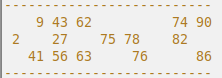
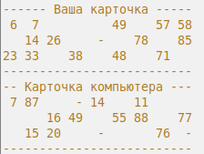

#### == Лото ==
Правила игры в лото.

Игра ведется с помощью специальных карточек, на которых отмечены числа, и фишек (бочонков) с цифрами.

Количество бочонков — 90 штук (с цифрами от 1 до 90).

Каждая карточка содержит 3 строки по 9 клеток. В каждой строке по 5 случайных цифр, расположенных по возрастанию. Все цифры в карточке уникальны. Пример карточки:

В игре 2 игрока: пользователь и компьютер. Каждому в начале выдается случайная карточка.

Каждый ход выбирается один случайный бочонок и выводится на экран.
Также выводятся карточка игрока и карточка компьютера.

Пользователю предлагается зачеркнуть цифру на карточке или продолжить.
Если игрок выбрал "зачеркнуть":
* Если цифра есть на карточке - она зачеркивается и игра продолжается.
* Если цифры на карточке нет - игрок проигрывает и игра завершается.

Если игрок выбрал "продолжить":
* Если цифра есть на карточке - игрок проигрывает и игра завершается.
* Если цифры на карточке нет - игра продолжается.

Побеждает тот, кто первый закроет все числа на своей карточке.

Пример одного хода:

Новый бочонок: 70 (осталось 76)

Зачеркнуть цифру? (y/n)
